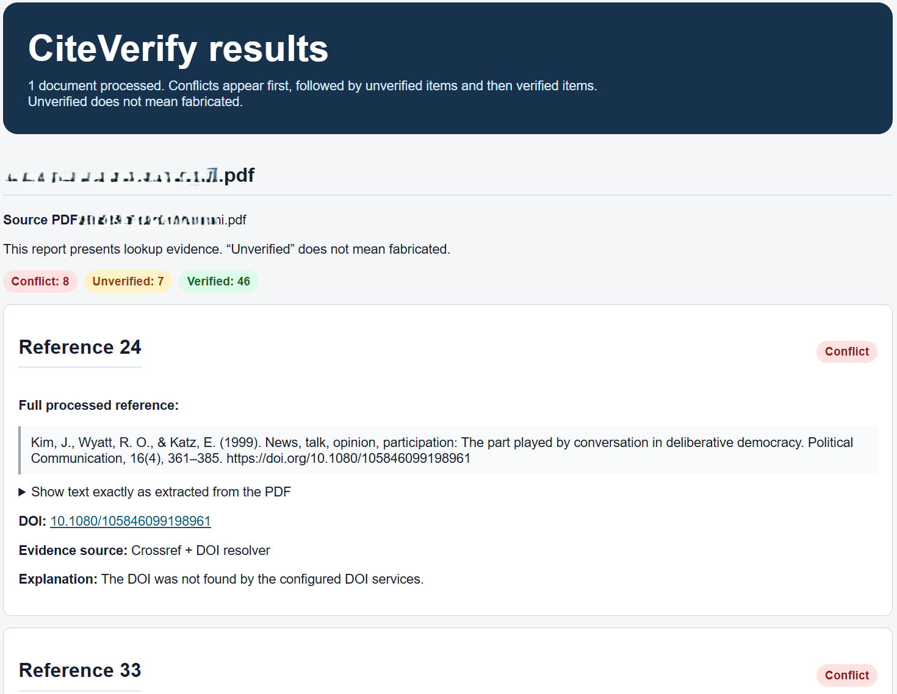

# CiteVerify

**Current version: 0.1.2**

CiteVerify is a local tool for reviewing references in research papers. It
extracts references from PDF and Word files, looks for matching scholarly
records, and creates a readable HTML report.

It is designed to help researchers find citations that deserve a closer look.
It is not an automatic fact-checker, and **unverified does not mean fake**.

[GitHub repository](https://github.com/cuihuash/citeverify)

## What CiteVerify accepts

The HTML interface accepts multiple files at once:

- PDF files (`.pdf`)
- Modern Word files (`.docx`)

Older Word files (`.doc`) should be saved as `.docx` before uploading.

## What CiteVerify produces

For every extracted reference, the HTML report shows:

- the full processed reference;
- the text extracted from the original file;
- the DOI, when one is present;
- a clickable DOI link;
- the verification status;
- the evidence sources used;
- an explanation when the reference is unverified or conflicting.

When several papers are uploaded, the report provides links to jump between
each document's results. Results are ordered by attention level:

1. Conflict
2. Unverified
3. Unable to check
4. Verified title variant
5. Verified

The original reference order or number is retained so results can be compared
with the paper.

## Interface preview




## How verification works

CiteVerify uses several sources when appropriate:

- Crossref and the DOI resolver for references with DOIs;
- OpenAlex and Semantic Scholar for optional independent scholarly cross-checks;
- Open Library and Google Books for books and reports.

Titles are compared cautiously because databases may use different
punctuation, subtitles, editions, or wording. A failed search can happen for
many innocent reasons, including a missing DOI, an older book, an unusual
title, or imperfect PDF text extraction.

## Quick start on Windows

### 1. Install Python

Install [Python 3.10 or newer](https://www.python.org/downloads/). During
installation, select **Add Python to PATH** if that option is shown.

### 2. Download CiteVerify

Download the repository from GitHub and unzip it, or clone it with Git. Keep
all of the files together in the `CiteVerify` folder.

### 3. Install the required Python packages

Open PowerShell, move into the CiteVerify folder, and run:

```powershell
python -m pip install -r requirements.txt
```

If Windows does not recognize `python`, try:

```powershell
py -m pip install -r requirements.txt
```

This installation is normally needed only once per computer.

### 4. Start CiteVerify

Double-click `Start-CiteVerify.bat`. Keep the window open while using the
browser interface.

Open <http://127.0.0.1:8765/> if the browser does not open automatically.
Select one or more files and click **Process references**.

When you are finished, return to the launcher window and press **Ctrl+C**.

## macOS and Linux

Install Python 3.10 or newer, then open Terminal and run:

```bash
cd "/path/to/CiteVerify"
python3 -m pip install -r requirements.txt
bash ./start-citeverify.sh
```

Open <http://127.0.0.1:8765/> in a browser. Leave Terminal open while using
the application.

## Optional API keys

API keys are optional. CiteVerify still runs without them, but OpenAlex and
Semantic Scholar cross-checks will be skipped.

To enable them, create these two plain-text files in the same folder as the
launcher:

```text
openalex.txt
S2.txt
```

Put only the relevant key in each file. Do not add quotes or explanatory
text.

Get keys from the providers' official pages:

- [OpenAlex API keys](https://openalex.org/settings/api)
- [Semantic Scholar API](https://www.semanticscholar.org/product/api)

The filenames are excluded by `.gitignore`. Never commit or upload them.

## Privacy and security

- CiteVerify runs locally on your computer. Uploaded papers are not uploaded
  to outside servers or large language models.
- CiteVerify does not use a large language model to read, rewrite, or judge
  your references.
- When enabled, lookup services mean online scholarly and book-search
  services such as Crossref, OpenAlex, Semantic Scholar, Google Books, and
  Open Library. CiteVerify may send limited reference information, such as a
  DOI or title, to these services to look for a matching record.
- API keys are read locally and are not placed in reports.
- Do not upload private papers, reports, diagnostics, or API keys to a public
  repository.

## Known limitations

PDFs are designed for visual display, not clean data extraction. Results may
need manual review when a paper contains:

- scanned or image-only pages;
- unusual fonts or encoding;
- complex tables or multi-column layouts;
- page, line, or paragraph numbers in the reference text;
- references split across pages;
- books, reports, webpages, or sources without DOIs.

The report includes both the extracted text and the processed reference so the
result can be compared with the original paper.

## Troubleshooting

### The browser page does not open

Make sure the launcher window is still open, then visit
<http://127.0.0.1:8765/> manually.

### The page does not change after clicking “Process references”

Refresh the browser with **Ctrl+F5** and make sure an older CiteVerify window
is not already using port 8765. Close an older copy with **Ctrl+C**, then
restart the launcher.

### The report shows only the document name

No references were extracted. The PDF may be scanned, may use an unusual
reference heading, or may have a layout that needs additional parser support.

### A real reference is marked unverified

Unverified means that CiteVerify did not find enough evidence. Compare the
processed reference and the extracted text with the original paper, then
review the DOI or title manually.

### The port is already in use

Close the other CiteVerify window, or start the application on another port:

```powershell
python .\citeverify_web.py --port 8766
```

Then open <http://127.0.0.1:8766/>.

## Advanced command-line use

Most users should use the HTML interface. The parser and lookup scripts are
also available for diagnostics and batch workflows:

```powershell
python .\citeverify_parser.py "C:\path\to\paper.pdf"
python .\citeverify_parser.py "C:\path\to\paper.pdf" --json "diagnostics.json"
python .\citeverify_lookup.py "diagnostics.json" --report "report.html"
```

## Project files

- `citeverify_web.py` — local HTML upload and results interface
- `citeverify_parser.py` — PDF and reference extraction
- `citeverify_lookup.py` — DOI, scholarly, and catalog lookups
- `Start-CiteVerify.bat` — Windows launcher
- `start-citeverify.sh` — macOS/Linux launcher
- `requirements.txt` — Python dependencies
- `VERSION` — current release version
- `CHANGELOG.md` — release history

## Contributing

Bug reports and improvements are welcome. When reporting a parsing problem,
please include the PDF layout details, the extracted text shown in the report,
and the operating system. Do not upload private papers or API keys.

See [CONTRIBUTING.md](CONTRIBUTING.md) for development notes.

## License

CiteVerify is released under the [MIT License](LICENSE).
