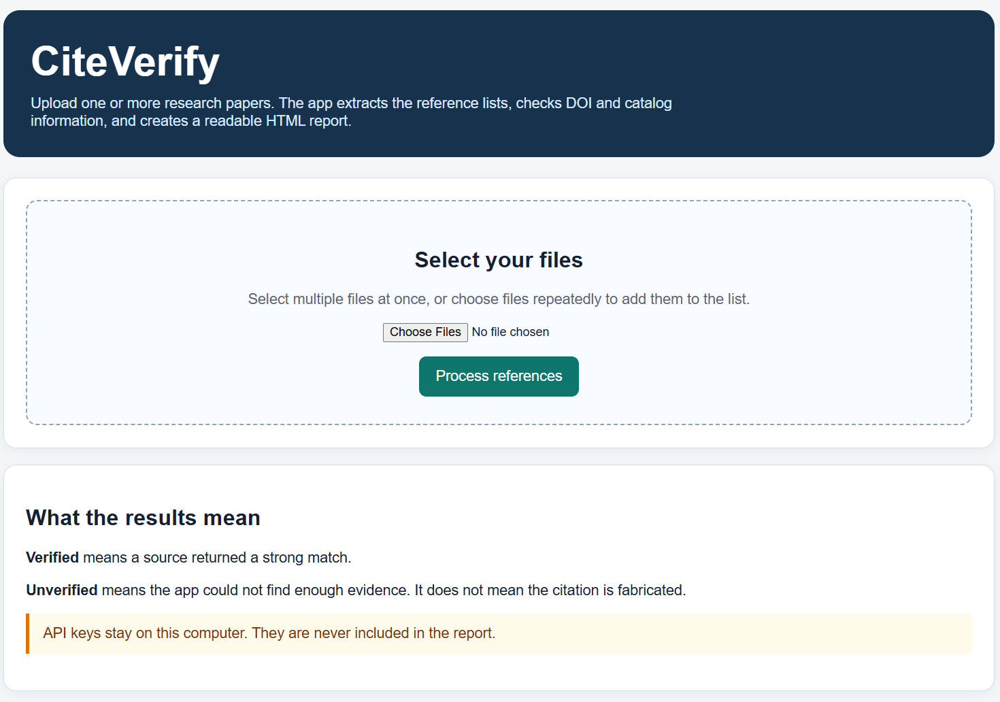

# CiteVerify

**Current version: 0.1.0**

CiteVerify is a local tool for checking the reference lists in research
papers. It extracts citations from PDF and modern Word files, searches for
matching scholarly records, and creates an HTML report for human review.

## Interface preview



## What it does

CiteVerify:

1. Finds the reference list in each uploaded document.
2. Extracts the references.
3. Corrects some common PDF-reading problems, including page, line, and
   paragraph numbers accidentally becoming part of a title.
4. Finds DOI and other identifiers when they are present.
5. Checks references against DOI, scholarly, and book databases.
6. Produces an HTML report with the evidence and clickable DOI links.

It is deliberately cautious. **Unverified** does not mean fake. It means that
the available information was not enough to confirm the source. Books, older
publications, webpages, unusual titles, and poorly extracted PDF text can all
produce an unverified result.

CiteVerify is a review aid, not an automatic final decision-maker.

## Input and output

The HTML interface accepts multiple files in one run:

- PDF files (`.pdf`)
- Modern Word files (`.docx`)

Older Word files ending in `.doc` should be opened in Word and saved as
`.docx` first.

The HTML report includes:

- every processed reference;
- the original extracted text;
- the cleaned or processed reference;
- DOI information and a clickable DOI link, when available;
- verification status;
- evidence sources;
- an explanation for unverified or conflicting results.

When several documents are uploaded, the report includes a document list at
the top. Each filename links to its results, and each document section links
back to the list.

Results are ordered by attention level:

1. **Conflict**
2. **Unverified**
3. **Unable to check**
4. **Verified title variant**
5. **Verified**

The original reference number is preserved even after the results are sorted.

## How verification works

- References with DOIs are checked through Crossref and a DOI resolver.
- If supplied by the user, OpenAlex and Semantic Scholar provide independent
  scholarly cross-checks.
- Books and reports are searched in Open Library and Google Books.
- Titles are compared cautiously because databases may use different editions,
  punctuation, subtitles, or wording.

The tool does not label a reference fake simply because a search finds no
match.

## Quick start for Windows users

### Requirements

- Windows 10 or later
- Python 3.10 or newer from [python.org](https://www.python.org/downloads/)
- This repository copied or downloaded to your computer

During Python installation, select **Add Python to PATH** if that option is
shown.

### Install the dependencies

Open PowerShell and run these commands, one at a time. Replace the path with
the location of your local CiteVerify folder:

```powershell
cd "C:\path\to\CiteVerify"
python -m pip install -r requirements.txt
```

If Windows cannot find `python`, try `py` instead:

```powershell
py -m pip install -r requirements.txt
```

You normally need to install the dependencies only once per computer.

### Run the HTML interface

Without API keys:

```powershell
python .\citeverify_web.py
```

With API-key files:

```powershell
python .\citeverify_web.py `
  --openalex-key-file "C:\path\to\openalex.txt" `
  --s2-api-key-file "C:\path\to\S2.txt"
```

Leave the PowerShell window open while using the app. Open
<http://127.0.0.1:8765/> in your browser, upload one or more files, and click
**Process references**.

The app shows the selected filenames before processing. A paper with many
references may take several minutes because each reference may be checked by
more than one online service.

When finished, return to PowerShell and press **Ctrl+C** to stop the app.

## One-click Windows launcher

After installing Python and the dependencies, double-click
`Start-CiteVerify.bat` in File Explorer. Keep the window open and visit
<http://127.0.0.1:8765/>.

The launcher looks for these optional files beside itself:

- `openalex.txt`
- `S2.txt`

Each file should contain only one API key on one line. These filenames are
ignored by Git and must never be committed to GitHub.

If the files are absent, CiteVerify still runs. It simply skips the OpenAlex
and Semantic Scholar cross-checks.

## Getting your own API keys

API keys are optional, but they provide additional independent evidence.

### OpenAlex

1. Visit the [OpenAlex API key page](https://openalex.org/settings/api).
2. Create or sign in to an OpenAlex account.
3. Copy the key into a plain-text file named `openalex.txt`.
4. Put `openalex.txt` beside `Start-CiteVerify.bat`, or pass its path in the
   PowerShell command.

OpenAlex's official documentation is available at
[developers.openalex.org](https://developers.openalex.org/api-reference/authentication).

### Semantic Scholar

1. Visit the [Semantic Scholar API page](https://www.semanticscholar.org/product/api).
2. Request an API key using the form on that page.
3. Copy the key into a plain-text file named `S2.txt`.
4. Put `S2.txt` beside `Start-CiteVerify.bat`, or pass its path in the
   PowerShell command.

Semantic Scholar's API documentation explains that API keys are sent in the
`x-api-key` request header.

### Protect your keys

Do not:

- paste keys into Python files;
- put keys in the README;
- commit keys to GitHub;
- upload key files in an issue or pull request.

The repository's `.gitignore` excludes `openalex.txt`, `S2.txt`, and common
secret-file patterns. The program reads keys locally and does not place them
in its reports.

## Sharing or installing from GitHub

To share CiteVerify with another person, share the repository or its downloaded
ZIP file. Each person should:

1. Install Python.
2. Download or clone the repository.
3. Run `python -m pip install -r requirements.txt`.
4. Obtain their own API keys, if desired.
5. Create their own `openalex.txt` and `S2.txt` files.
6. Start CiteVerify with `Start-CiteVerify.bat` or the PowerShell command.

Do not include your personal papers, generated reports, API keys, or private
diagnostics when sharing the project.

## Publishing this folder to GitHub

The project is prepared as a local Git repository. Before making it public,
review the files that will be committed and confirm that no private papers,
reports, diagnostics, or API keys are included.

### GitHub Desktop

GitHub Desktop is the easiest option for people who do not normally use Git
commands:

1. Install [GitHub Desktop](https://desktop.github.com/).
2. Open GitHub Desktop and choose **Add > Add existing repository**.
3. Select the local `CiteVerify` folder.
4. Review the changed files. The `.gitignore` should exclude private outputs
   and key files.
5. Choose **Publish repository**.
6. Give the repository the name `CiteVerify` and choose whether it should be
   public or private.

### Git commands

From PowerShell inside the CiteVerify folder:

```powershell
git init
git add .
git status
git commit -m "Prepare CiteVerify 0.1.0"
```

Then create an empty repository named `CiteVerify` on GitHub and follow
GitHub's instructions to connect the local repository and push it.

## Optional command-line tools

Most users should use the HTML interface. The command-line tools are useful
for diagnosing extraction or creating a report from a saved diagnostics file.

Extract references from a PDF:

```powershell
python .\citeverify_parser.py "C:\path\to\paper.pdf"
```

Save parser diagnostics as JSON:

```powershell
python .\citeverify_parser.py `
  "C:\path\to\paper.pdf" `
  --json "C:\path\to\diagnostics.json"
```

Verify a diagnostics file:

```powershell
python .\citeverify_lookup.py "C:\path\to\diagnostics.json"
```

Use API-key files with the command-line verifier:

```powershell
python .\citeverify_lookup.py `
  "C:\path\to\diagnostics.json" `
  --openalex-key-file "C:\path\to\openalex.txt" `
  --s2-api-key-file "C:\path\to\S2.txt"
```

Use `--limit 2` to check only the first two references while testing.

## Common problems

### Python is not recognized

Install Python again and select **Add Python to PATH**. You can also replace
`python` with `py` in the commands.

### The page does not change after clicking Process references

Make sure the PowerShell or launcher window is still open. Refresh the browser
with **Ctrl+F5**. If an older copy is using port 8765, close that copy with
**Ctrl+C** and start CiteVerify again.

### The page says that a port is already in use

Another copy is already running. Close it with **Ctrl+C**, or use another port:

```powershell
python .\citeverify_web.py --port 8766
```

Then open <http://127.0.0.1:8766/>.

### A real reference is marked unverified

This does not necessarily indicate a problem with the source. Compare the
processed reference and the extracted text with the original paper. Check for
PDF extraction errors, books, older sources, title variations, and missing
DOIs. You can also search the title manually.

### The reference list is extracted incorrectly

PDFs are designed for displaying pages, not for storing clean reference data.
Multi-column layouts, scanned pages, unusual fonts, page numbers, and line
numbers can confuse the parser. Use the report's extracted-text section to
compare the result with the original PDF.

### An API service is unavailable

Lookup services require an internet connection and may be busy, rate-limited,
or temporarily unavailable. An unavailable service does not prove that a
reference is false. Try again later or review the DOI and title manually.

## Privacy

- CiteVerify runs on your computer.
- Uploaded files are processed by the local program.
- DOI and title information may be sent to configured lookup services.
- API keys are read locally and are not written into reports.
- Keep private papers, generated reports, diagnostics, and API keys out of
  public GitHub repositories.

## Project files

- `citeverify_web.py`: the HTML upload and results interface.
- `citeverify_parser.py`: PDF parsing and citation diagnostics.
- `citeverify_lookup.py`: DOI and catalog verification.
- `Start-CiteVerify.bat`: one-click Windows launcher.
- `requirements.txt`: Python dependencies.
- `VERSION`: current release version.
- `CHANGELOG.md`: release history.
- `.gitignore`: files that should not be uploaded to GitHub.
